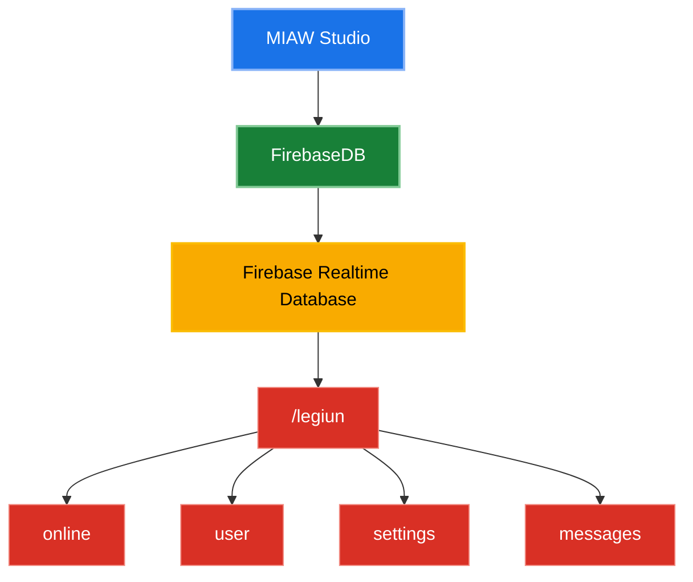
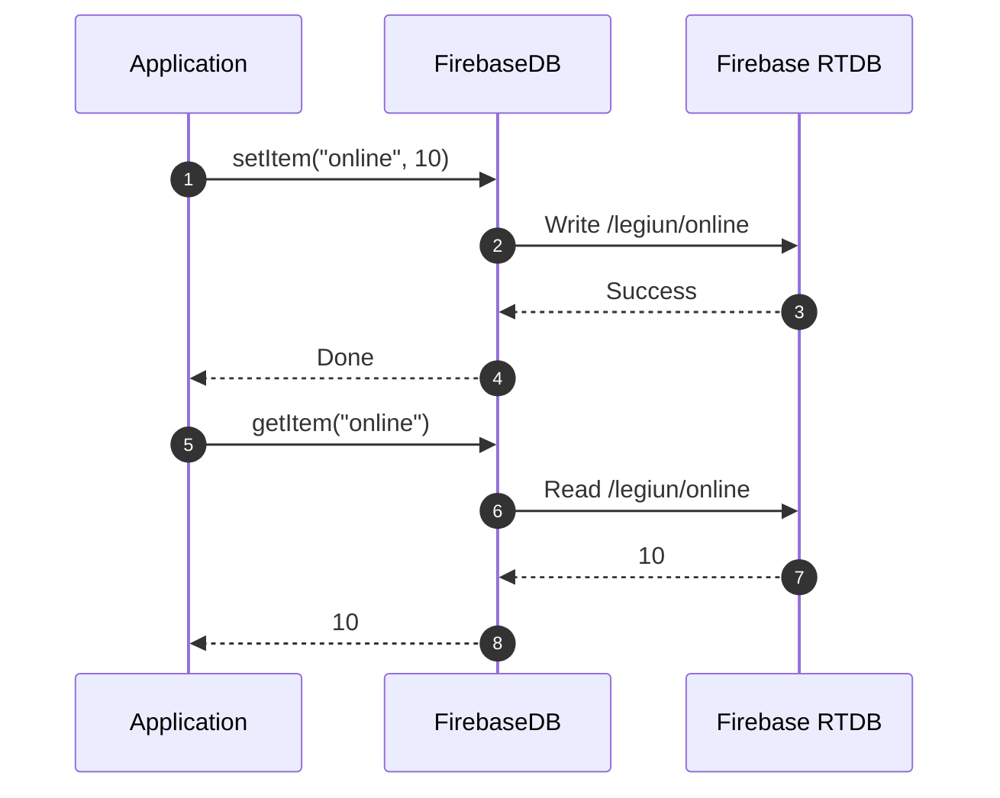
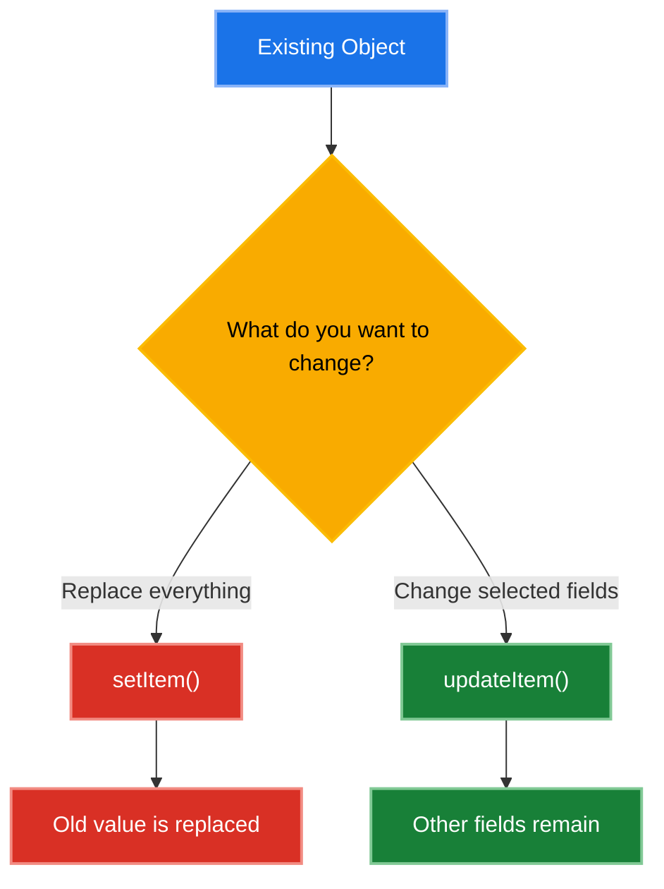
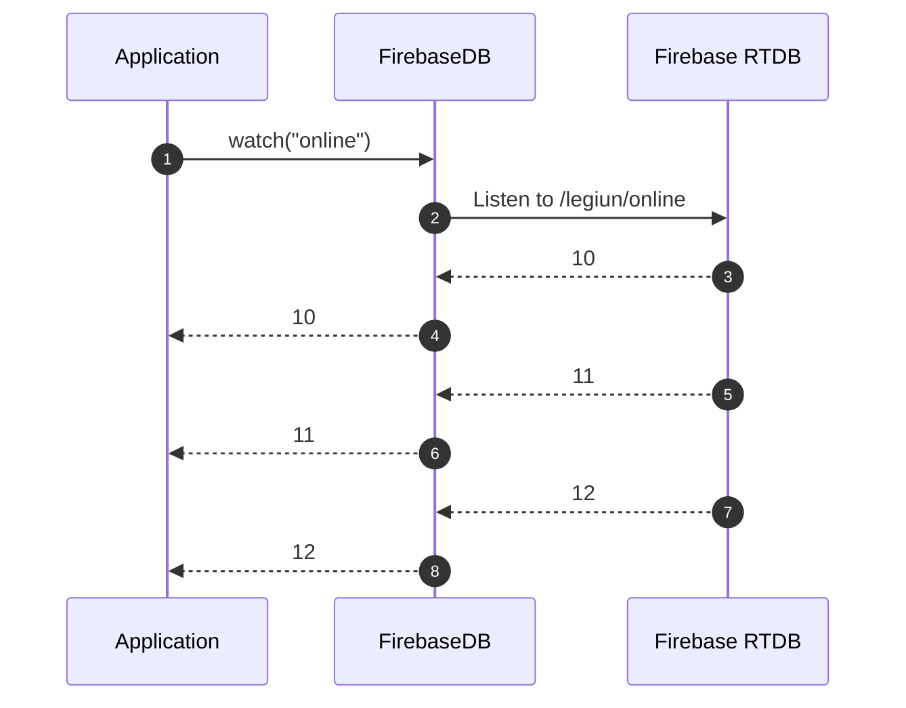
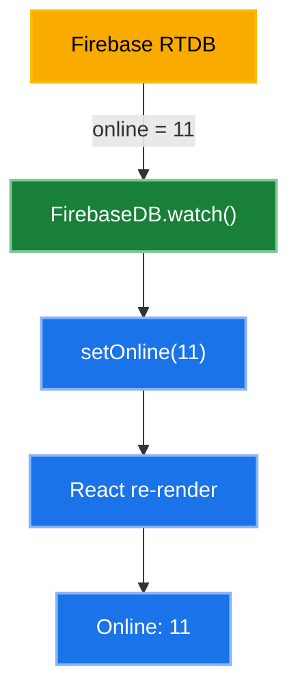

# FirebaseDB

`FirebaseDB` is a small helper for working with **Firebase Realtime
Database**.

It provides a simple API for storing, reading, updating, deleting,
checking, listing, counting, and watching data.

All data managed by `FirebaseDB` is stored under the `/legiun` root.

---

## Table of Contents

- [Overview](#overview)
- [Import](#import)
- [Database Structure](#database-structure)
- [How Paths Work](#how-paths-work)
- [How It Works](#how-it-works)
- [Writing Data](#writing-data)
    - [`setItem()`](#setitem)
    - [Replacing an Object](#replacing-an-object)
- [Reading Data](#reading-data)
    - [`getItem()`](#getitem)
    - [Missing Data](#missing-data)
- [Updating Data](#updating-data)
    - [`updateItem()`](#updateitem)
    - [`setItem()` vs `updateItem()`](#setitem-vs-updateitem)
- [Deleting Data](#deleting-data)
    - [`removeItem()`](#removeitem)
    - [`clear()`](#clear)
- [Checking Data](#checking-data)
    - [`hasItem()`](#hasitem)
    - [`keys()`](#keys)
    - [`length()`](#length)
- [Realtime Data](#realtime-data)
    - [`watch()`](#watch)
    - [Unsubscribe](#unsubscribe)
    - [Realtime Flow](#realtime-flow)
- [Using with React](#using-with-react)
- [Using Objects](#using-objects)
- [Error Handling](#error-handling)
- [Async / `await`](#async--await)
- [Simple Example](#simple-example)
- [Complete Example](#complete-example)
- [API Summary](#api-summary)

---

## Overview

Think of Firebase as an online cupboard where your application can store
and retrieve data.

The relationship between your application, `FirebaseDB`, and Firebase
Realtime Database is:



All data managed by `FirebaseDB` is stored inside:

```text
/legiun
```

The `legiun` part is handled automatically.

---

## Import

Import `FirebaseDB` from the database module:

```ts
import { FirebaseDB } from "@legiun/database";
```

---

## Database Structure

A simple database might look like this:

```text
/
└── legiun/
    ├── online: 10
    ├── user/
    │   ├── name: "Kuro"
    │   └── online: true
    ├── settings/
    │   ├── theme: "dark"
    │   └── language: "en"
    └── messages/
        └── ...
```

For example:

```ts
await FirebaseDB.setItem("user", {
	name: "Kuro",
	online: true
});
```

creates data equivalent to:

```text
legiun
└── user
    ├── name: "Kuro"
    └── online: true
```

---

## How Paths Work

You provide a key relative to the `/legiun` root.

For example:

```ts
FirebaseDB.getItem("online");
```

actually accesses:

```text
/legiun/online
```

Likewise:

```ts
FirebaseDB.getItem("user");
```

accesses:

```text
/legiun/user
```

You do not need to include `/legiun` yourself.

---

## How It Works

The basic request flow is:



Because Firebase communicates through the network, most database
operations are asynchronous.

---

# Writing Data

## `setItem()`

Use `setItem()` to save data.

### Syntax

```ts
await FirebaseDB.setItem("key", value);
```

### Save a primitive value

```ts
await FirebaseDB.setItem("online", 10);
```

The database becomes:

```text
legiun
└── online: 10
```

### Save an object

You can also save an object:

```ts
await FirebaseDB.setItem("user", {
	name: "Kuro",
	online: true
});
```

The database becomes:

```text
legiun
└── user
    ├── name: "Kuro"
    └── online: true
```

---

## Replacing an Object

`setItem()` replaces the value at the specified path.

For example:

```ts
await FirebaseDB.setItem("user", {
	name: "Kuro",
	online: true
});

await FirebaseDB.setItem("user", {
	name: "Reichi"
});
```

The final data is:

```text
legiun
└── user
    └── name: "Reichi"
```

The previous `online` property is removed because the entire object was
replaced.

> **Use `updateItem()` instead if you only want to change selected
> fields.**

---

# Reading Data

## `getItem()`

Use `getItem()` to retrieve data.

### Syntax

```ts
const value = await FirebaseDB.getItem<T>("key");
```

The generic type `<T>` describes the type you expect to receive.

### Read a number

If the database contains:

```text
legiun
└── online: 10
```

you can read it with:

```ts
const online = await FirebaseDB.getItem<number>("online");

console.log(online);
```

Result:

```text
10
```

### Read a string

```ts
const name = await FirebaseDB.getItem<string>("name");
```

### Read a boolean

```ts
const online = await FirebaseDB.getItem<boolean>("online");
```

---

## Missing Data

If the requested data does not exist, `getItem()` returns `null`.

```ts
const data = await FirebaseDB.getItem<string>("unknown");

console.log(data);
```

Result:

```text
null
```

You can provide a fallback value with the nullish coalescing operator:

```ts
const online = (await FirebaseDB.getItem<number>("online")) ?? 0;
```

This means:

> If `online` does not exist, use `0`.

---

# Updating Data

## `updateItem()`

Use `updateItem()` when you only want to change part of an existing
object.

Suppose the database contains:

```text
legiun
└── user
    ├── name: "Kuro"
    └── online: true
```

You can change only `online`:

```ts
await FirebaseDB.updateItem("user", {
	online: false
});
```

The result becomes:

```text
legiun
└── user
    ├── name: "Kuro"
    └── online: false
```

The `name` property stays unchanged.

---

## `setItem()` vs `updateItem()`

The simplest rule is:

```text
                    Existing Object
                          │
                          ▼
                 ┌─────────────────┐
                 │ What do you     │
                 │ want to change? │
                 └────────┬────────┘
                          │
             ┌────────────┴────────────┐
             │                         │
             ▼                         ▼
     Replace everything       Change selected fields
             │                         │
             ▼                         ▼
        setItem()                updateItem()
             │                         │
             ▼                         ▼
      Old value is             Other fields
         replaced                remain
```

Or as a Mermaid diagram:



### Example

Starting data:

```text
user
├── name: "Kuro"
├── online: true
└── role: "admin"
```

Using `setItem()`:

```ts
await FirebaseDB.setItem("user", {
	name: "Reichi"
});
```

Result:

```text
user
└── name: "Reichi"
```

Using `updateItem()`:

```ts
await FirebaseDB.updateItem("user", {
	name: "Reichi"
});
```

Result:

```text
user
├── name: "Reichi"
├── online: true
└── role: "admin"
```

---

# Deleting Data

## `removeItem()`

Use `removeItem()` to delete data at a specific key.

```ts
await FirebaseDB.removeItem("user");
```

Before:

```text
legiun
├── online
└── user
```

After:

```text
legiun
└── online
```

Only the specified `user` data is removed.

---

## `clear()`

Use `clear()` to remove everything inside `/legiun`.

```ts
await FirebaseDB.clear();
```

Before:

```text
legiun
├── online
├── user
├── settings
└── messages
```

After:

```text
legiun
```

> **Warning:** `clear()` removes every value inside `/legiun`.

---

# Checking Data

## `hasItem()`

Use `hasItem()` to check whether data exists.

```ts
const exists = await FirebaseDB.hasItem("user");

console.log(exists);
```

If the data exists:

```text
true
```

If it does not:

```text
false
```

### Example

```ts
if (await FirebaseDB.hasItem("user")) {
	console.log("User found!");
}
```

---

## `keys()`

Use `keys()` to get the names of the data directly inside `/legiun`.

For example:

```text
legiun
├── online
├── user
├── settings
└── messages
```

Use:

```ts
const keys = await FirebaseDB.keys();

console.log(keys);
```

Result:

```ts
["online", "user", "settings", "messages"];
```

`keys()` only returns direct children.

It does not recursively search nested objects.

For example:

```text
legiun
├── online
└── user
    ├── name
    └── settings
        └── theme
```

`keys()` returns:

```ts
["online", "user"];
```

It does not return:

```ts
["online", "user", "name", "settings", "theme"];
```

---

## `length()`

Use `length()` to count the direct keys inside `/legiun`.

```ts
const length = await FirebaseDB.length();

console.log(length);
```

If the database contains:

```text
legiun
├── online
├── user
├── settings
└── messages
```

the result is:

```text
4
```

Like `keys()`, `length()` counts only direct children.

---

# Realtime Data

## `watch()`

Use `watch()` when you want to receive changes automatically.

```ts
const unsubscribe = FirebaseDB.watch<number>("online", (value) => {
	console.log("Online:", value);
});
```

If the value changes:

```text
10 → 11 → 12 → 13
```

the callback receives:

```text
Online: 10
Online: 11
Online: 12
Online: 13
```

You do not need to repeatedly call `getItem()`.

---

## Unsubscribe

`watch()` returns a function that stops the listener.

```ts
const unsubscribe = FirebaseDB.watch<number>("online", (value) => {
	console.log(value);
});

unsubscribe();
```

After `unsubscribe()` is called, the listener stops receiving changes.

This is especially useful when a component or page is removed.

---

## Realtime Flow



The important difference is:

```text
getItem()
└── Read once

watch()
└── Keep listening for changes
```

---

# Using with React

`watch()` works well with React's `useEffect()`.

```tsx
import { useEffect, useState } from "react";
import { FirebaseDB } from "@legiun/database";

export function Chat(): React.JSX.Element {
	const [online, setOnline] = useState(0);

	useEffect(() => {
		return FirebaseDB.watch<number>("online", (value) => {
			setOnline(value ?? 0);
		});
	}, []);

	return <div>Online: {online}</div>;
}
```

If Firebase contains:

```text
legiun
└── online: 10
```

the page displays:

```text
Online: 10
```

If Firebase changes to:

```text
legiun
└── online: 11
```

React automatically updates the page:

```text
Online: 11
```

The flow is:



---

# Using Objects

For larger objects, use a TypeScript interface.

```ts
interface User {
	name: string;
	age: number;
	online: boolean;
}
```

Save the object:

```ts
await FirebaseDB.setItem<User>("user", {
	name: "Kuro",
	age: 17,
	online: true
});
```

Read it:

```ts
const user = await FirebaseDB.getItem<User>("user");

console.log(user?.name);
console.log(user?.age);
console.log(user?.online);
```

Result:

```text
Kuro
17
true
```

The generic type helps TypeScript understand the expected shape of the
returned data.

---

# Error Handling

Database operations can fail because of network problems, Firebase
permissions, or other errors.

Use `try...catch` when you need to handle errors.

### Writing

```ts
try {
	await FirebaseDB.setItem("online", 1);
} catch (error) {
	console.error("Failed to write data:", error);
}
```

### Reading

```ts
try {
	const user = await FirebaseDB.getItem<User>("user");

	console.log(user);
} catch (error) {
	console.error("Failed to read data:", error);
}
```

---

# Async / `await`

Firebase communicates through the network, so reading and writing data
takes some time.

For example:

```ts
const online = await FirebaseDB.getItem<number>("online");
```

`await` means:

> Wait until Firebase finishes the operation and gives us the result.

The following methods return a `Promise`:

```text
getItem()
setItem()
updateItem()
removeItem()
hasItem()
keys()
length()
clear()
```

`watch()` is different.

It uses a callback and returns an unsubscribe function:

```ts
const unsubscribe = FirebaseDB.watch("online", callback);
```

---

# Simple Example

A minimal read/write example:

```ts
await FirebaseDB.setItem("online", 1);

const online = await FirebaseDB.getItem<number>("online");

console.log(online);
```

Result:

```text
1
```

---

# Complete Example

The following example combines realtime data with a normal object read:

```tsx
import { useEffect, useState } from "react";
import { FirebaseDB } from "@legiun/database";

interface User {
	name: string;
	online: boolean;
}

export function Example(): React.JSX.Element {
	const [online, setOnline] = useState(0);
	const [user, setUser] = useState<User | null>(null);

	useEffect(() => {
		return FirebaseDB.watch<number>("online", (value) => {
			setOnline(value ?? 0);
		});
	}, []);

	useEffect(() => {
		FirebaseDB.getItem<User>("user").then(setUser).catch(console.error);
	}, []);

	return (
		<div>
			<p>Online: {online}</p>
			<p>User: {user?.name ?? "Unknown"}</p>
		</div>
	);
}
```

This example demonstrates:

1.  Listening to `online` with `watch()`.
2.  Updating React state when `online` changes.
3.  Reading a `User` object with `getItem()`.
4.  Handling a missing user with `??`.
5.  Handling read errors with `.catch()`.

---

# API Summary

---

Method Return Purpose

---

`getItem<T>(key)` `Promise<T \| null>` Get data

`setItem<T>(key, value)` `Promise<void>` Save or replace data

`updateItem<T>(key, value)` `Promise<void>` Update part of an
object

`removeItem(key)` `Promise<void>` Delete data

`hasItem(key)` `Promise<boolean>` Check if data exists

`keys()` `Promise<string[]>` Get direct keys

`length()` `Promise<number>` Count direct keys

`clear()` `Promise<void>` Delete everything
inside `/legiun`

`watch<T>(key, callback)` `() => void` Listen for realtime
changes

---

---

## Quick Reference

If you only need the essentials:

```ts
// Create / replace
await FirebaseDB.setItem("user", {
	name: "Kuro",
	online: true
});

// Read
const user = await FirebaseDB.getItem<User>("user");

// Update selected fields
await FirebaseDB.updateItem("user", {
	online: false
});

// Check existence
const exists = await FirebaseDB.hasItem("user");

// Delete
await FirebaseDB.removeItem("user");

// Listen for changes
const unsubscribe = FirebaseDB.watch<User>("user", (user) => {
	console.log(user);
});

// Stop listening
unsubscribe();
```

### Remember

```text
setItem()    → Replace
updateItem() → Modify selected fields
getItem()    → Read
removeItem() → Delete one key
clear()      → Delete everything
hasItem()    → Check existence
keys()       → List direct keys
length()     → Count direct keys
watch()      → Listen for changes
```
